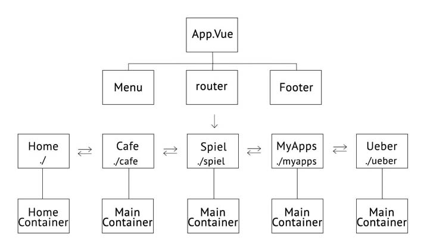

# auf-der-reise

### Link to the Website: [https://aufderreise.com/](https://aufderreise.com/)

## About The Project

Seit langem habe ich so geplant, meine eigene Webseite zu erstellen und darin meine Reisen vorzustellen. 
Als der zweite Zweck zur Webseite benutze ich sie als Portfolio, meine Programmierung-Werke vorzustellen. 
Die Seite wird gleich umgebaut, als ein Projekt mit Vue CLI.  under constuction...

## Technologies Used 

* HTML5
* CSS3
* JavaScript
* Vue.js / Vue CLI / Vue Router
* Node.js / npm
* BootstrapVue
* [Google Fonts (Josefin Sans)](https://fonts.google.com/specimen/Josefin+Sans)

## Tools Used

* Visual Studio Code
* Adobe Photoshop
* FileZilla
* [Xserver (Webhosting) ](https://www.xserver.ne.jp/) 

## Features

In "repository" werden nicht ganze Projekt-Files der Webseite gelegt.   
Bei diesem Projekt wird das JavaScript Framework Vue.js / Vue CLI benutzt. Mit Vue Router wird als Single-Page-Application inplementiert.

#### Overview

##### aufderreise.com/spiel

#### Data / Components Structure

## Roadmap

See the [issues](https://github.com/nao-mix/auf-der-reise/issues) for a list of proposed features.

## Contact

naomix - [AUF DER REISE](https://aufderreise.com/) - info@aufderreise.com

