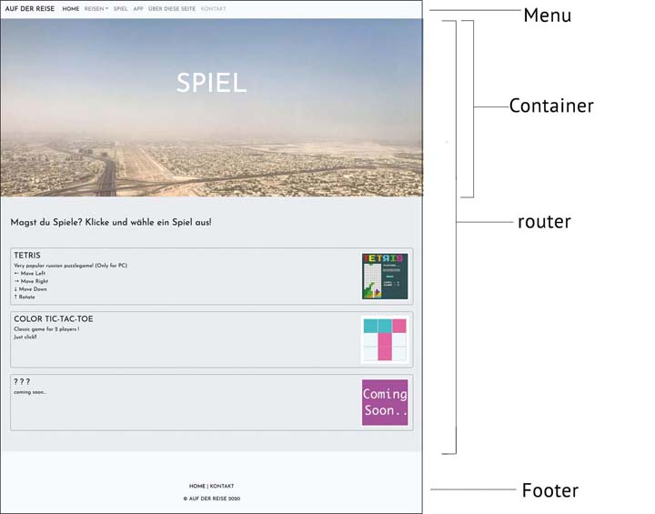
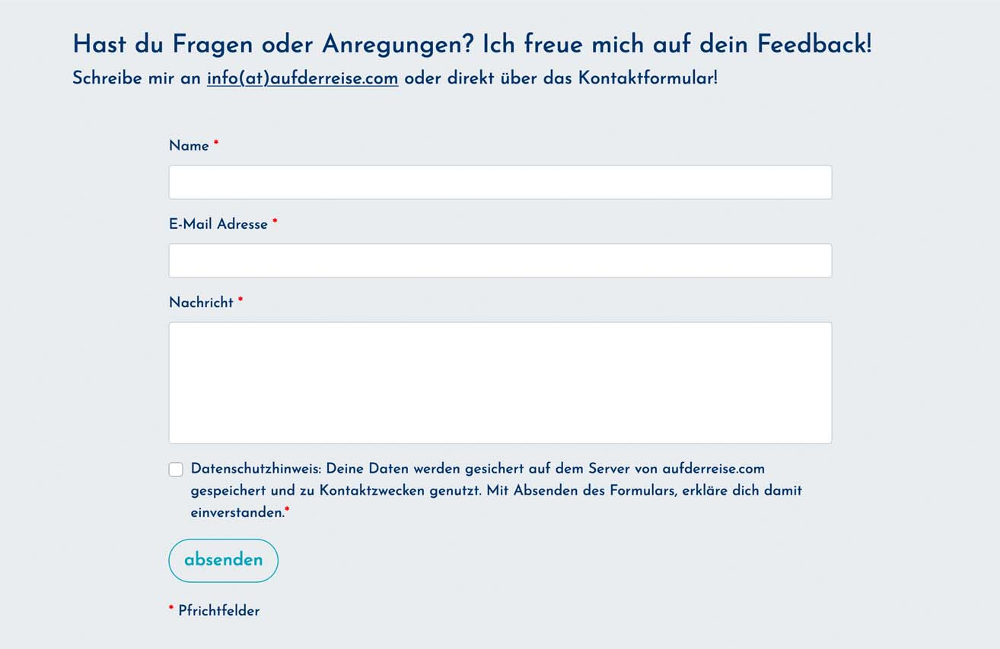

# auf-der-reise

### Link to the Website: [https://aufderreise.com/](https://aufderreise.com/)

## About The Project

Seit langem habe ich so geplant, meine eigene Webseite zu erstellen und darin meine Reisen vorzustellen. 
Als der zweite Zweck zur Webseite benutze ich sie als Portfolio, meine Programmierung-Werke vorzustellen. 
Die Seite wird gleich umgebaut, als ein Projekt mit Vue CLI.  under constuction...

## Technologies Used 

* HTML5
* CSS3
* JavaScript
* PHP
* Vue.js / Vue CLI / Vue Router
* Node.js / npm
* Axios
* Bootstrap
* [Google reCAPTCHA v3](https://developers.google.com/recaptcha)
* [Google Fonts (Josefin Sans)](https://fonts.google.com/specimen/Josefin+Sans)

## Tools Used

* Visual Studio Code
* Adobe Photoshop
* FileZilla
* [Xserver (Webhosting) ](https://www.xserver.ne.jp/) 

## Features

Bei diesem Projekt wird das JavaScript Framework Vue.js / Vue CLI benutzt. Mit Vue Router wird als Single-Page-Application inplementiert.

#### Overview

##### aufderreise.com/spiel

#### Contact Form / vs. Bots

In der Subpage "Kontakt" habe ich ein Kontaktformular gestellt. Wenn ein Besucher das Formular ausfüllt und eine Nachricht absendet, bekommt der Besucher eine Bestätigungsemail per PHP. 
Für den Spamschutz beim Kontaktformular habe ich Google reCAPTCHA v3 benutzt.

 

## Roadmap

See the [issues](https://github.com/nao-mix/auf-der-reise/issues) for a list of proposed features.

## Contact

naomix - [AUF DER REISE](https://aufderreise.com/) - info@aufderreise.com

